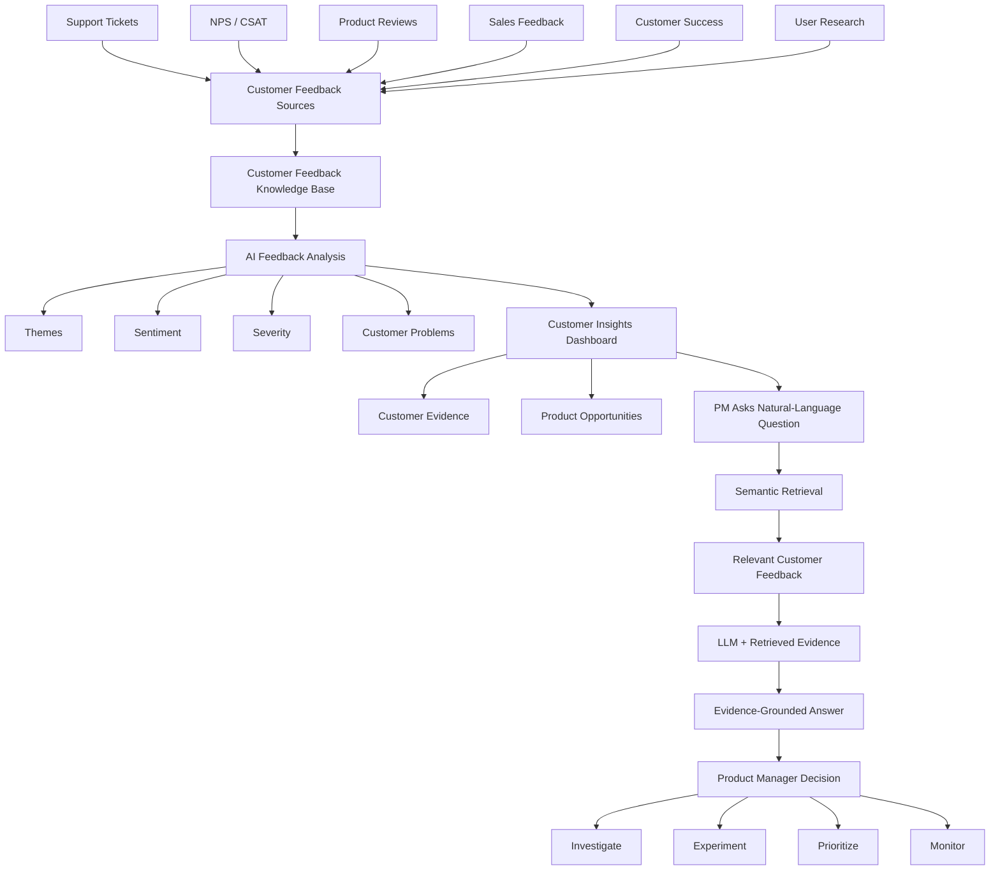
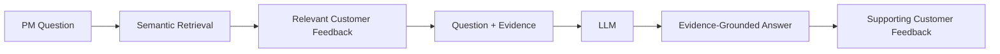
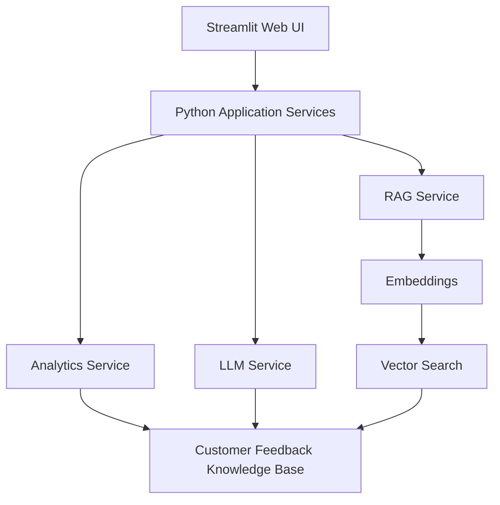

# Customer Insights Intelligence

> **AI-powered Customer Insights Intelligence platform that transforms fragmented customer feedback into actionable insights and evidence-backed product opportunities.**

## What Product is this?

Customer Insights Intelligence is a web application designed to help Product Managers understand large volumes of qualitative customer feedback.

Customer feedback is often distributed across support tickets, NPS/CSAT surveys, product reviews, Sales conversations, Customer Success interactions, and user research.

The platform brings these signals together, uses AI to identify recurring customer problems and patterns, and allows Product Managers to investigate those insights through an interactive dashboard and natural-language questions.

AI-generated insights remain connected to the underlying customer evidence so Product Managers can evaluate the evidence before making product decisions.

> **Product principle: AI assists; Product Managers decide.**

---

## The Problem

Product teams can receive thousands of qualitative customer signals across multiple channels.

Manually synthesizing this feedback can be:

* Time-consuming
* Fragmented across tools and teams
* Difficult to quantify
* Influenced by recent or anecdotal feedback
* Difficult to connect directly to product opportunities

The challenge is not simply collecting more feedback. The challenge is determining:

* What problems occur repeatedly?
* Which problems are increasing?
* Which customer segments are affected?
* How severe are those problems?
* What customer evidence supports an insight?
* Which problems deserve deeper product investigation?

---

## Who Is This For?

### Primary User

**Product Managers working with moderate-to-large volumes of qualitative customer feedback.**

The Product Manager is responsible for translating customer signals into product problems, opportunities, experiments, prioritization decisions, and roadmap discussions.

Potential secondary users include:

* Product Operations
* Product Leadership
* Customer Success
* UX Research

---

# Product Experience

The MVP is designed around three primary Product Manager experiences.

## 1. Customer Insights Dashboard

When the Product Manager opens the application, the dashboard provides a summarized view of customer feedback.

The dashboard will surface information such as:

* Number of feedback records analyzed
* Overall customer sentiment
* Top recurring customer problems
* Emerging themes
* Affected customer segments
* Problem frequency
* Trend direction

For example, the PM might see:

| Customer Problem   | Signals | Insight          |
| ------------------ | ------: | ---------------- |
| Mobile Onboarding  |     184 | Emerging problem |
| Reporting & Export |     147 | Enterprise-heavy |
| Authentication     |     121 | Recurring issue  |

The PM can select a customer problem and inspect the evidence supporting the insight.

---

## 2. Customer Evidence & Product Opportunity

When the PM selects a customer problem, the application displays additional context.

For example:

### Reporting & Export

**Customer signals:** 147
**Primary affected segment:** Enterprise

**Recurring problems:**

* Limited export formats
* Large reports timing out
* Lack of scheduled report delivery

**Supporting customer evidence:**

* F104 — "We need Excel export..."
* F281 — "Large reports keep timing out..."
* F390 — "We need scheduled reports..."

The PM can use this evidence to determine whether the problem deserves deeper investigation.

The application surfaces evidence and potential product opportunities. It does **not** autonomously determine what should be placed on the product roadmap.

---

## 3. Ask Customer Insights

The PM can also investigate customer feedback using natural-language questions.

Example:

> **What problems are enterprise customers experiencing with reporting?**

The system retrieves relevant customer feedback and provides that evidence to the LLM.

The resulting response might identify recurring issues such as:

1. Limited export formats
2. Large-report timeouts
3. Lack of scheduled report delivery

The response also displays the customer-feedback records supporting those conclusions.

This allows the PM to evaluate the evidence instead of treating the AI response as ground truth.

---

# End-to-End Product Workflow

---

# How the GenAI Experience Works

Three concepts are important to distinguish.

## Knowledge Base

The **knowledge base** contains the customer information the application can search and analyze.

For the MVP, this will be a synthetic customer-feedback dataset representing:

* Support tickets
* NPS / CSAT comments
* Product reviews
* Sales feedback
* Customer Success feedback
* User research

Using synthetic data allows us to demonstrate the complete workflow without exposing real customer information or personally identifiable information.

A production version could eventually connect directly to enterprise customer-feedback systems.

---

## User Prompt

The **user prompt** is the question entered by the Product Manager.

For example:

> **What are enterprise customers struggling with during onboarding?**

The prompt represents what the PM wants to learn.

The prompt is different from the knowledge base.

**Knowledge Base = customer information available to the system**

**User Prompt = question the PM wants answered**

---

## Retrieval-Augmented Generation (RAG)

The application does not simply send the PM's question directly to the LLM.

Instead, it first retrieves customer feedback relevant to the question.

This pattern is known as **Retrieval-Augmented Generation (RAG)**.

RAG helps ground generated responses in application-specific customer evidence rather than relying solely on the model's pre-trained knowledge.

RAG does not eliminate hallucination risk. Retrieval quality and answer grounding therefore need to be evaluated separately.

---

# What Uses AI — and What Does Not?

The application intentionally does not use an LLM for every operation.

## LLM / Semantic AI

Used where understanding or generating natural language is valuable:

* Understanding qualitative customer feedback
* Theme identification
* Customer-problem extraction
* Sentiment and severity interpretation
* Product-opportunity summarization
* Natural-language Q&A
* Evidence synthesis

## Deterministic Analytics

Used where conventional computation is more reliable:

* Counting feedback records
* Filtering customer segments
* Calculating percentages
* Aggregating classified themes
* Measuring trends
* Calculating product metrics

> **Design principle: Use deterministic computation where possible and GenAI where semantic interpretation or generation is required.**

---

# MVP Technical Architecture

---

## Technology Choices

| Component       | MVP Technology     | Purpose                                          |
| --------------- | ------------------ | ------------------------------------------------ |
| Language        | Python             | Application and AI development                   |
| Web UI          | Streamlit          | Rapid interactive MVP development                |
| Data Processing | Pandas             | Feedback processing and deterministic analytics  |
| LLM             | LLM API            | Qualitative analysis and insight generation      |
| Embeddings      | Embedding model    | Semantic representation of feedback              |
| Vector Search   | Local vector store | Retrieve semantically relevant customer evidence |
| Data            | CSV / JSON         | Lightweight MVP knowledge base                   |
| Testing         | pytest             | Application and AI evaluation tests              |
| Source Control  | GitHub             | Versioning, documentation, and portfolio         |

---

## Why Streamlit for the MVP?

The MVP optimizes for **learning velocity and end-to-end validation rather than production frontend architecture**.

Streamlit allows the user interface, data workflow, and AI capabilities to be developed using a single Python stack.

A production implementation could separate:

* Frontend application
* API layer
* AI services
* Data persistence
* Authentication and authorization
* Monitoring and observability
* Enterprise integrations

This allows the MVP to focus on validating the GenAI product experience without introducing unnecessary frontend and infrastructure complexity.

---

# MVP Scope

The initial MVP demonstrates:

**Customer Feedback → AI Analysis → Themes & Problems → Insights Dashboard → Customer Evidence → RAG Q&A → Product Opportunity**

## MVP Capabilities

* Customer-feedback ingestion
* Theme identification
* Sentiment classification
* Severity classification
* Customer-problem aggregation
* Evidence linking
* Product-opportunity summaries
* Product Manager dashboard
* Semantic retrieval
* RAG-based Customer Insights Q&A
* Basic AI evaluation

## Not in the MVP

* Production Salesforce or Zendesk integrations
* Real customer PII
* Autonomous product prioritization
* Automatic roadmap modification
* Enterprise authentication
* Production-scale infrastructure
* Multi-agent workflows

---

# Product Hypothesis

> **If Product Managers can use AI to identify recurring customer problems across fragmented feedback while retaining access to the underlying customer evidence and relevant business context, they can move from customer signals to actionable product opportunities faster and with greater confidence.**

---

# Product Principles

1. **Customer problems before features**
2. **Evidence before recommendations**
3. **AI assists; Product Managers decide**
4. **Insights should be traceable to customer evidence**
5. **Use deterministic computation where possible**
6. **Uncertainty should be visible**
7. **Product opportunities should connect to measurable outcomes**

---

# Product Roadmap

**Product Discovery → Feedback-to-Insight MVP → Evidence-Grounded AI / RAG → Product Decision Intelligence → Workflow Integrations → Enterprise Readiness**

The MVP focuses on proving the **feedback → insight → evidence → product opportunity** workflow before introducing enterprise-scale integrations and advanced decision-support capabilities.

---

# Current Project Status

## Milestone 1 — Product Definition ✅

Completed:

* Problem definition
* Product hypothesis
* MVP requirements
* Product roadmap
* Technical program execution plan

## Milestone 2 — Technical Design 🔄

Current focus:

* System architecture
* Data model
* LLM workflow
* RAG architecture
* AI evaluation strategy

## Milestone 3 — MVP Implementation

Next:

* Synthetic feedback dataset
* Feedback-analysis pipeline
* LLM integration
* Streamlit dashboard
* Semantic retrieval
* RAG Q&A
* AI evaluation

---

# Project Documentation

The README provides the end-to-end project overview. Detailed product and program artifacts are maintained separately.

| Document                                                           | Purpose                                                                    |
| ------------------------------------------------------------------ | -------------------------------------------------------------------------- |
| [Problem Statement](docs/discovery/problem-statement.md)           | Problem context, user pain points, opportunity, and assumptions            |
| [MVP Product Requirements](docs/product/prd.md)                    | Users, JTBD, requirements, MVP scope, metrics, and acceptance criteria     |
| [Product Roadmap](docs/product/roadmap.md)                         | Outcome-based evolution of the product                                     |
| [Technical Program Execution Plan](docs/program/execution-plan.md) | Workstreams, dependencies, milestones, risks, and program success criteria |

Additional architecture and AI-evaluation documentation will be added as implementation progresses.

---

# Portfolio Focus

This project demonstrates end-to-end Product Management, Technical Product Management, and Technical Program Management concepts across:

* Product discovery
* Customer problem definition
* Product strategy
* Requirements definition
* Jobs to Be Done
* MVP prioritization
* Roadmap development
* GenAI product design
* Technical architecture
* Cross-functional program planning
* Dependency management
* Risk management
* LLM integration
* Prompt design
* Semantic retrieval
* Retrieval-Augmented Generation (RAG)
* Evidence grounding
* AI evaluation
* Product analytics
* MVP development

---

*This project is under active development. Product assumptions, architecture decisions, and implementation details will evolve as the MVP is built and evaluated.*
