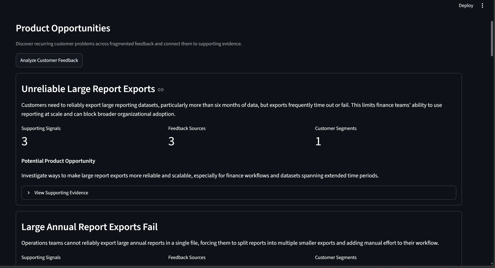
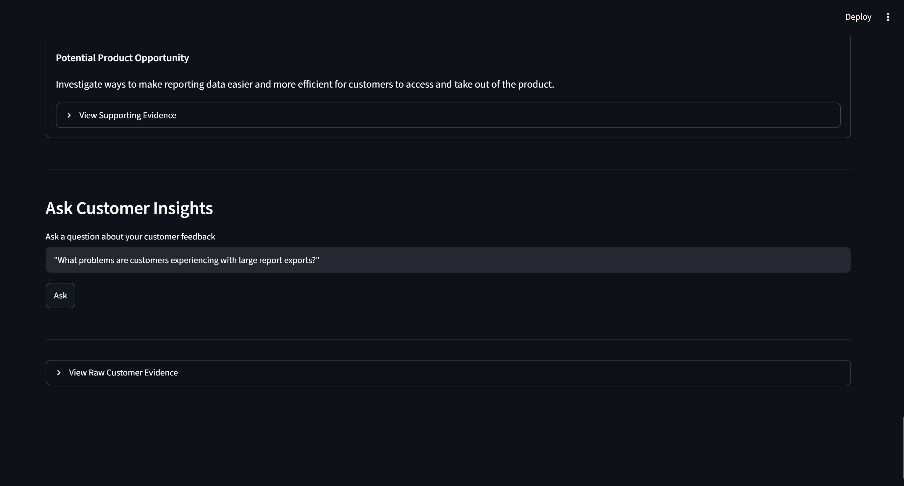
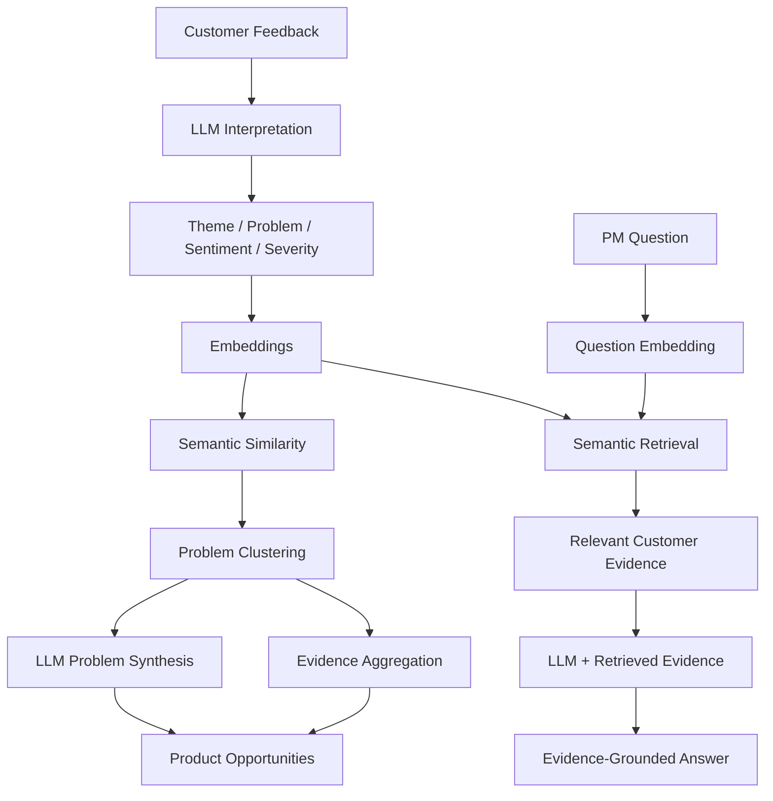

# Customer Insights Intelligence

> **AI-powered Customer Insights platform that transforms fragmented qualitative feedback into evidence-backed customer problems and product opportunities.**

**Product principle: AI assists; Product Managers decide.**

## What Product Is This?

Customer Insights Intelligence is a GenAI-powered web application designed to help Product Managers understand qualitative customer feedback distributed across sources such as Support, Sales, Customer Success, surveys, product reviews, and user research.

The application uses AI to interpret customer feedback, discover recurring customer problems, synthesize potential product opportunities, and allow PMs to investigate the underlying evidence through natural-language questions.

AI-generated insights remain connected to customer evidence so the PM — not the model — makes the product decision.

## The Problem

Product teams can receive thousands of qualitative customer signals across different tools and teams. Manually synthesizing that information is time-consuming, fragmented, and vulnerable to anecdotal or recent feedback.

The core questions are:

* What customer problems occur repeatedly?
* Which customer segments are affected?
* How severe are those problems?
* What evidence supports an insight?
* Which problems deserve deeper product investigation?

## Target User

**Primary:** Product Managers working with moderate-to-large volumes of qualitative customer feedback.

Potential secondary users include Product Operations, Product Leadership, Customer Success, and UX Research.

## Working MVP

### AI-Discovered Product Opportunities

The MVP analyzes individual customer signals, represents the underlying problems semantically, discovers related feedback, and synthesizes evidence-backed product opportunities.

### Ask Customer Insights — RAG

Product Managers can also investigate the analyzed feedback using natural-language questions.

The application retrieves semantically relevant customer evidence and supplies that evidence to the LLM so the generated response remains grounded in the available customer data.

## How the GenAI Workflow Works

### Why combine LLMs, embeddings, and deterministic code?

**LLM / Generative AI**

* Interpret qualitative feedback
* Identify underlying customer problems
* Assess sentiment and severity
* Synthesize related feedback into product opportunities
* Generate evidence-grounded answers

**Embeddings**

* Represent customer problems semantically
* Identify semantically related feedback
* Retrieve relevant evidence for RAG

**Deterministic Python**

* Calculate cosine similarity
* Perform threshold-based clustering
* Aggregate evidence and metadata
* Orchestrate the end-to-end workflow

> **Design principle: Use deterministic computation where possible and GenAI where semantic interpretation or generation adds value.**

## MVP Technical Architecture

| Component       | Technology        | Purpose                                      |
| --------------- | ----------------- | -------------------------------------------- |
| Language        | Python            | Application and AI workflow                  |
| Web UI          | Streamlit         | Interactive MVP                              |
| Data Processing | Pandas            | Feedback processing                          |
| LLM             | OpenAI API        | Interpretation and synthesis                 |
| Embeddings      | OpenAI Embeddings | Semantic representation and retrieval        |
| Similarity      | Cosine similarity | Feedback comparison                          |
| Data            | Synthetic CSV     | Lightweight customer-feedback knowledge base |
| Validation      | Pydantic          | Structured LLM outputs                       |
| Source Control  | GitHub            | Versioning and portfolio documentation       |

Synthetic data is intentionally used so the complete workflow can be demonstrated without exposing real customer information or PII.

## Evaluation & Learnings

The prototype was tested end to end on a small synthetic customer-feedback dataset.

A semantic-similarity sanity test produced:

* **Related feedback:** `0.821`
* **Unrelated feedback:** `0.219`

The full pipeline successfully processed 20 customer signals through LLM interpretation, embeddings, semantic clustering, evidence aggregation, and opportunity synthesis.

RAG testing successfully retrieved relevant evidence for a question about large-report export problems and generated a grounded answer that distinguished directly supporting evidence from adjacent evidence.

### Current limitation

The MVP uses a lightweight threshold-based clustering strategy where records are compared against a representative record from each cluster.

Initial evaluation showed that a `0.80` similarity threshold can over-segment some semantically related customer feedback. A production implementation would evaluate threshold calibration and more robust clustering techniques against a larger labeled dataset.

This is intentionally treated as an evaluation finding rather than hard-coding the expected groups.

## Product Hypothesis

> **If Product Managers can use AI to identify recurring customer problems across fragmented feedback while retaining access to the underlying customer evidence, they can move from customer signals to actionable product opportunities faster and with greater confidence.**

## MVP Scope

**Implemented**

* Synthetic customer-feedback ingestion
* Structured LLM feedback analysis
* Theme, sentiment, severity, and customer-problem extraction
* Embedding generation
* Semantic similarity and problem discovery
* Evidence aggregation
* Product-opportunity synthesis
* Streamlit interface
* Semantic retrieval
* RAG-based Customer Insights Q&A
* Evidence-grounded responses
* Basic AI evaluation

**Future improvements**

* Larger evaluation dataset
* Improved clustering and threshold calibration
* Persistent vector storage
* Incremental processing and embedding reuse
* Asynchronous/batched processing
* Retrieval-quality evaluation
* Cost and latency observability
* Enterprise feedback-system integrations
* Authentication, authorization, and data governance

## Product Principles

1. **Customer problems before features**
2. **Evidence before recommendations**
3. **AI assists; Product Managers decide**
4. **Insights should remain traceable to customer evidence**
5. **Use deterministic computation where possible**
6. **Make uncertainty visible**

## Project Documentation

| Document                                                           | Purpose                                                            |
| ------------------------------------------------------------------ | ------------------------------------------------------------------ |
| [Problem Statement](docs/discovery/problem-statement.md)           | Problem context, user pain points, opportunity, and assumptions    |
| [MVP Product Requirements](docs/product/prd.md)                    | Users, JTBD, requirements, scope, metrics, and acceptance criteria |
| [Product Roadmap](docs/product/roadmap.md)                         | Outcome-based product evolution                                    |
| [Technical Program Execution Plan](docs/program/execution-plan.md) | Workstreams, dependencies, milestones, risks, and success criteria |

## Portfolio Focus

This project demonstrates hands-on experience across **Product Management, Technical Product Management, Technical Program Management, and GenAI application development**, including product discovery, requirements, architecture, LLM integration, embeddings, semantic retrieval, RAG, evidence grounding, AI evaluation, technical trade-offs, and end-to-end MVP execution.

---

*Portfolio prototype built to explore how GenAI can augment — rather than replace — evidence-based product decision making.*
