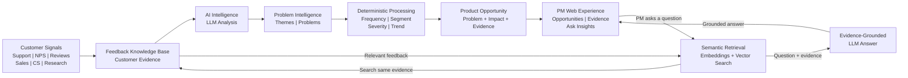

# Customer Insights Intelligence — System Design

## System Goal

Transform fragmented customer feedback into **evidence-backed customer problems and product opportunities**, while allowing Product Managers to investigate those opportunities using natural-language questions.

> **Customer Signals → Understand Problems → Build Evidence → Surface Opportunities → PM Investigates**

---

## End-to-End System Architecture

### How to Read the Architecture

The architecture contains **one continuous product intelligence loop**.

**1. Customer Signals → Knowledge Base**
Feedback from Support, NPS, Reviews, Sales, Customer Success, and Research becomes the evidence available to the system.

**2. Knowledge Base → AI Intelligence**
The LLM interprets qualitative feedback and identifies meaning that would be difficult to capture using keyword rules alone.

**3. AI Intelligence → Problem Intelligence**
Related customer signals are transformed into recurring themes and underlying customer problems.

**4. Problem Intelligence → Deterministic Processing**
Traditional application logic measures frequency, affected segments, severity, and trends.

**5. Processing → Product Opportunity**
Customer problems are combined with measurable impact and supporting evidence to surface potential product opportunities.

**6. Product Opportunity → PM Web Experience**
The Product Manager explores opportunities, supporting evidence, and underlying customer problems.

**7. PM Investigation → RAG Loop**
When the PM asks a question, embeddings and vector search retrieve relevant feedback from the **same knowledge base**.

The retrieved evidence and PM question are provided to the LLM, which returns an evidence-grounded answer to the PM.

---

## Two Capabilities, One Architecture

The architecture supports two connected capabilities:

| Capability                             | Flow                                                                                       |
| -------------------------------------- | ------------------------------------------------------------------------------------------ |
| **Opportunity Intelligence**           | Customer Signals → AI Understanding → Problems → Evidence & Impact → Product Opportunities |
| **Conversational Investigation (RAG)** | PM Question → Semantic Retrieval → Customer Evidence → LLM → Grounded Answer               |

RAG is therefore **not a separate chatbot added to the product**. It is the investigation layer that lets the PM go deeper into the customer problems and opportunities already surfaced by the system.

---

## MVP Technology Stack

| Component                       | Technology                                |
| ------------------------------- | ----------------------------------------- |
| PM Web Experience               | Streamlit                                 |
| Application Logic               | Python                                    |
| Data Processing                 | Pandas                                    |
| Qualitative Understanding       | LLM API                                   |
| Semantic Representation         | Embeddings                                |
| Evidence Retrieval              | Vector Search                             |
| Evidence-Grounded Investigation | RAG                                       |
| Knowledge Base                  | Synthetic multi-channel customer feedback |

---

## Key Design Decisions

**One evidence source** — Opportunity generation and conversational investigation use the same underlying customer-feedback knowledge base.

**GenAI + deterministic processing** — LLMs understand qualitative meaning; traditional code measures frequency, segments, severity, and trends.

**Evidence-first AI** — Customer problems, opportunities, and conversational answers remain connected to original customer evidence.

**Human-in-the-loop** — AI surfaces problems and potential opportunities; the Product Manager determines what to investigate, validate, or prioritize.

---

## Architecture Summary

> **The system turns multi-channel customer signals into measurable, evidence-backed product opportunities and then uses RAG over the same customer evidence to help Product Managers investigate those opportunities further.**
